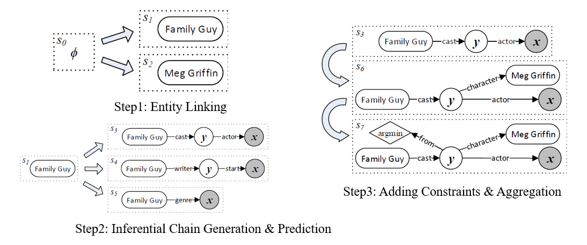
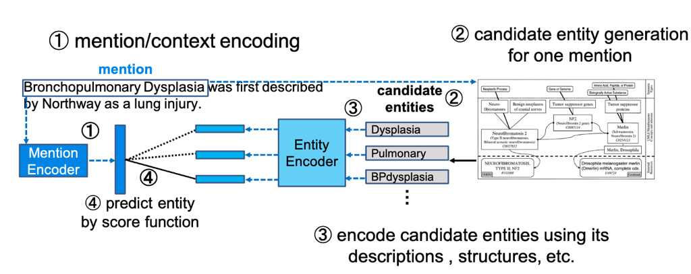
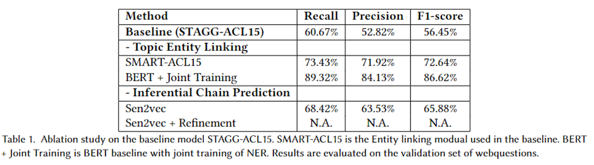

# Semantic Parsing for KGQA

## Baseline
- STAGG ([link](chrome-extension://efaidnbmnnnibpcajpcglclefindmkaj/https://www.microsoft.com/en-us/research/wp-content/uploads/2016/02/ACL15-STAGG.pdf)) is one of the most foundation work of semantic parsing in knowledge graph based question answering. However, due to the old version of its components: **Entity linking (EL) and Inferential Chain Prediction**, it gives unpromising performance.
- One intuition to solve this problem is to update the blocks of the whole model, like using transformers-based model as compensation.



## Mention Detection & Entity Linking
- Entity Linking can be separated from the KGQA as a specific task. It means that the entity-linked model can be trained and processed as a separate component, thus providing a high degree of flexibility in this step.
- In the original STAGG model, it use the **S-MART** to do the mention detection and entity linking. Here we use the **BERT-Joint Training**. You can use other strong entity-linking-based models to do the same work.


References:S-MART: Novel Tree-based Structured Learning Algorithms Applied to Tweet Entity Linking: https://arxiv.org/abs/1609.08075

### Ablation Study

According to Table 1, the overall F1 of the whole baseline is 56.45%, which is unpromising but reasonable. Because the topic entity linking module obtains 72.64% F1, and the inferential chain prediction module only achieves 65.88% F1.
Once simply replace the entity linking module from SMART-ACL (the module EL used in the baseline) to BERT + Joint training, it obtains almost **14% boosting** on this step.

Tips: You can find more details of this flexiable component here ([entity-linking-tutorial](https://github.com/izuna385/Entity-Linking-Tutorial)).

## Core Inferential Chain Generation

The main objective of this module is to fine-tune and evaluate a model (pre-trained on a large-scale dataset) on the core inferential chain generation. Here, I have taken an example of finetuning sequence-to-sequence models such as T5, using the Trainer API from Hugging Face.

* A number of pre-trained models can be finetuned such as:
    * T5 (small, base, large, 3B, 11B)
    * BART (base, large-cnn, large-mnli)
    * Longformer Encoder Decoder (allenai/led-base-16384, allenai/led-large-16384)
    * Pegasus (large, xsum, multi_news)

Checkout [pre-trained models](https://huggingface.co/models) to see the checkpoints available for each of them.

### Requirements
```bash
torch
transformers
datasets
pandas
```

### Datasets
Finetuning with MetaQA dataset placed at [data](https://github.com/Yuan-BertSui/seq2seq/tree/master/data).

Here's an sample of the training dataset. It has two columns, one is the text, and other one is the summary of the text (actually it is the inferential chain of the original text):
| text                                                                                    | summary                              |
|-----------------------------------------------------------------------------------------|--------------------------------------|
| The films that share actors with the [Dil Chahta Hai] film have been released for years | movie_to_actor_to_movie_to_year      |
| which are the directors of the films written by the writer of [The Green Mile]          | movie_to_writer_to_movie_to_director |

Tips: [] is the entity mention of the query sentences. To be noted that there's no need to label the entity mention at this stage.

### Script
Run the pretrained model using the following script.

```bash
python run.py \
    --model_name_or_path t5-base \
    --train_file ./data/train_csv_MetaQA.csv \
    --validation_file ./data/eval_csv_MetaQA.csv \
    --text_column text \
    --summary_column summary \
    --output_dir output/ \
    --overwrite_output_dir \
    --do_train \
    --do_eval \
    --num_beams 3 \
    --min_summ_length 5 \
    --max_summ_length 20 \
    --length_penalty 1.0 \
    --per_device_train_batch_size 8 \
    --per_device_eval_batch_size 8 \
    --predict_with_generate \
    --num_train_epochs 5 \
    --fp16 \
    --max_source_length 25 \
    --max_target_length 20 \
    --save_steps 10000 \
    --seed 1234 \
```
The 'model_name_or_path' refers to the pretrained_model files' name, 'train_file' refers to the training dataset of the model, 'validation_file' refers to the validation dataset of the model, 'text_column' refers to the query which needs to obtain the correponding core inferential chain, 'summary_column' refers to the corresponding core inferential of the query.
To be noted that the 'per_device_train/eval_batch_size' have a huge impact on the performance of the finetuning.

To see all the possible command line options, run:

```bash
python run.py --help
```

### Inference
Since the t5 is a generative model, the form of the generated sequence is uncertain. It needs to match the core inferential chain in our dataset. One simple intuition is to calculate the cosine similarity of both the generated sequence and the core inferential chain with the help of the embedding representation of the t5 model.

To see the inference model, please run the follow command:
```bash
python inference.py
```

1. We reload the tokenzier and model from the obtained pretrained model, and obtain the generated core inferential chain:
```python
# reload the tokenzier and model from the obtained pretrained model
tokenizer = AutoTokenizer.from_pretrained("checkpoint/t5-base")
model = T5ForConditionalGeneration.from_pretrained("checkpoint/t5-base")
summarizer = pipeline(task="summarization", model=model, tokenizer=tokenizer)

# obtain the generated core inferential chain of the query,
output_query = summarizer(input_query, max_length=20, min_length=18)
```
2. Obtain the representation of the generated core inferential chain of the query.
```python
# obtain the representation of the generated core inferential chain of the query
output_query_list = []
for i in range(len(output_query)):
    output_query_list.append(output_query[i]["summary_text"])
output_query_tokenzier = tokenizer(
    output_query_list,
    return_tensors="pt",
    padding=True,
    truncation=True
)
output_query_embedding = model.encoder(
    input_ids=output_query_tokenzier["input_ids"],
    attention_mask=output_query_tokenzier["attention_mask"],
    return_dict=True
)
output_query_embedding = output_query_embedding.last_hidden_state
```
3. Obtain the representation of the golden core inferential chain of the query (groundtruth).
```python
# obtain the embedding representation of the path targets
df = pd.read_csv("./data/train_csv.csv")
df = df.drop_duplicates(subset=['summary'])
path_targets = df["summary"].to_list()
path_tokenzier = tokenizer(
    path_targets,
    return_tensors="pt",
    padding=True,
    truncation=True
)
path_target_embedding = model.encoder(
    input_ids=path_tokenzier["input_ids"],
    attention_mask=path_tokenzier["attention_mask"],
    return_dict=True
)
path_target_embedding = path_target_embedding.last_hidden_state
```
4. To match the generated inferential chain to the golden one. One simple intuition is to calculate the cosine-similarity of the pair of inferential chain. 
```python
# calculate the vector similarity
def vector_similarity(v1, v2):
    # define the sentence vector
    def sentence_vector(v):
        sentence_vector = 0.0
        for i in range(v.shape[0]):
            sentence_vector += v[i]
        return sentence_vector / v.shape[0]
    v1, v2 = sentence_vector(v1), sentence_vector(v2)
    return torch.cosine_similarity(v1, v2, dim=0, eps=1e-6)
    
# replace the output with the high similarity target path
transfer_output = []
for i in range(len(output_query_list)):
    print(f"{output_query[i]['summary_text']}")
    target_path_index = 0
    max_score = 0.0
    for j in range(len(path_targets)):
        score = vector_similarity(output_query_embedding[i], path_target_embedding[j])
        print(f"{path_targets[j]} score={score:.6f}")
        if score > max_score:
            max_score = score
            target_path_index = j
        else:
            max_score = max_score
    print(f"Results: {output_query[i]['summary_text']}-> {path_targets[target_path_index]} with confidence {max_score:.6f}")
    transfer_output.append(path_targets[target_path_index])
```
Through the inference model, the generated core inferential chain can match the golden one with accuracy of 94%.

## Retrieval of answer(s) from KG

The final objective of a KG-QA system is to retrieve the correct answer from KG against a query q. To this end, we use the outputs of the different components aforementioned and feed them to complete the pre-written SPARQL sketchs. We can define a bunch of rules for different question-types and used a simple-mapping rules to map the queries to the sketches. 

For e.g., consider the query, q = “which are the directors of the films written by the writer of The Green Mile?”. The output of aforementionde module contains all the information that is required to form a structured query such as SPARQL. Like:
1. Linked Entities: e2: The Green Mile
2. Inference Chain: movie_to_writer_to_movie_to_director
we can fill a sketch using thses outputs. The generated SPARQL query is:
```bash
SELECT DISTINCT ?uri WHERE {
<e2><movie writer><?x>
<?x><writer movie><?y>
<?y><movie director><?uri>
}
```
Where, e2 is the unique identity assigned to "The Green Mile".